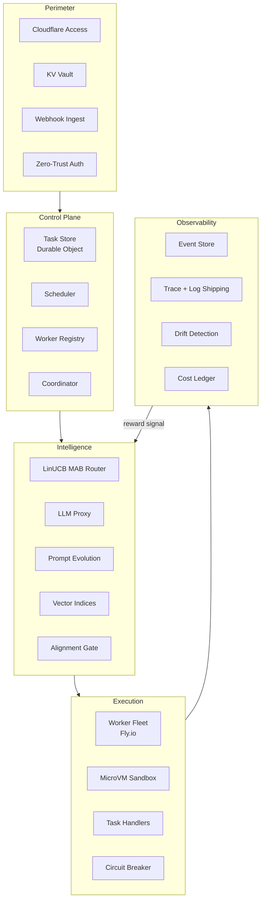

# Erebus Edge

Sovereign AI execution infrastructure for environments that resist it.

> Secrets bootstrap at runtime, live in-memory, and die with the process.
> The right system absorbs the friction so the operator does not have to.

## The hostile-network problem

Most AI tooling assumes unconstrained outbound access to provider APIs. In a firewalled enterprise, air-gapped environment, or regulated network, that assumption breaks completely — you literally cannot call Anthropic from inside the perimeter. Erebus Edge is built for exactly that condition: keys stay server-side in a KV vault, zero-trust auth through Cloudflare Access gates every surface, and the only traffic crossing the perimeter is webhook ingest.

The consequence is a design that is hostile-network-first, not hostile-network-compatible. Authentication is enforced at the perimeter before any request reaches the control plane. Model credentials never touch client processes. Inbound webhooks carry tasks; outbound traffic is controlled, minimal, and auditable. Enterprises with strict egress policy, FedRAMP-adjacent posture, or internal-only AI mandates can operate the system without relaxing their network controls to accommodate it.

## Architecture

**Perimeter.** External requests arrive as webhook payloads. Cloudflare Access enforces zero-trust authentication before any payload reaches internal services. Model credentials and secrets live in the KV vault, never in client processes or environment variables exposed to the execution tier.

**Control Plane.** Authenticated task payloads enter the task store, implemented as a Durable Object, which is the system of record for every active and historical workstream. The scheduler decomposes work into thin-sliced tasks with explicit dependencies and priorities resolved before dispatch. The coordinator and worker registry track live capacity across the execution fleet.

**Intelligence.** The LinUCB MAB router selects model arm and prompt path for each task class based on accumulated reward history. Requests pass through the LLM proxy, which enforces credential isolation and rate policy. Prompt evolution surfaces candidate improvements; the alignment gate validates outputs before they advance to execution.

**Execution.** The worker fleet on Fly.io receives dispatched tasks and runs them inside microVM sandboxes with no persistent state. Task handlers are stateless by design; the circuit breaker reaps stalled processes and carries crash context forward into retries so the system learns from failure, not only from success.

**Observability.** Every task event writes to the event store. Trace and log shipping gives operators a complete audit trail. Drift detection monitors MAB arm behavior for distribution shift. The cost ledger tracks per-task spend and feeds the reward signal that closes the loop back to the intelligence layer.

## What makes it different

Generation alone is not enough. RAG and CAG solve retrieval and context management — they make generation better-informed. They do not solve orchestration, cost optimization, failure recovery, or cross-task learning. A system that generates well but routes naively, retries dumbly, and forgets everything between runs is still expensive and fragile.

The MAB stack operates at a different layer. It is not a smarter prompt router. It is a learning system that accumulates reward signal across every task class, every model arm, and every cost tier, then uses that history to make better dispatch decisions over time. RAG improves what the model knows. The MAB improves which model you ask and what you pay for the answer. Those compound differently.

## SWU: the north-star metric

The north-star metric is SWU cost — Successful Work Unit cost. A SWU is a task that completes end-to-end, on the first attempt, at the cheapest tier the MAB router selected, with no retries, no escalations, and no human intervention. As Erebus Edge matures, SWU cost trends downward and SWU rate trends toward one.

That trajectory is the convergence graph that makes the system's intelligence legible. It is also what separates this from prompt engineering: Erebus Edge is not generating and hoping. It is learning which intelligence to apply to which problem and getting measurably better at that decision with every run.

## Status

**Active development · Private implementation · Status as of 2026-04**

Core routing intelligence and execution mesh are operational. This repository documents architecture and design decisions. Implementation is closed-source.

The system is not yet in general availability. Architectural documentation is published to support evaluation by infrastructure partners and credit programs.

## Resource partnerships

Rift Root LLC is bootstrapped by design. Cash dilutes; resources compound.

Compute credits, inference credits across multi-vendor model arms, hardware diversity (silicon variety enriches MAB convergence data), storage, egress allowance, and design partners with real workloads — anything that shortens the loop between hypothesis and validated output. The resulting workloads stay where they run.

Developer programs, infrastructure credit programs, and hardware access inquiries: [adam@riftroot.com](mailto:adam@riftroot.com)

## Contact

[adam@riftroot.com](mailto:adam@riftroot.com) · [riftroot.com/#erebus](https://riftroot.com/#erebus)