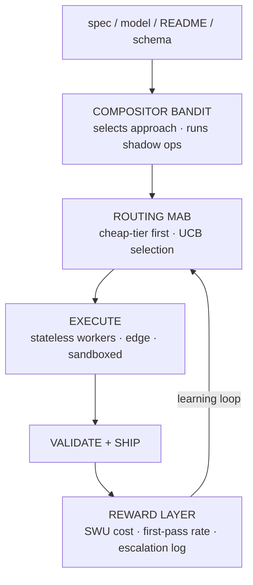

# Erebus Edge

Sovereign AI execution infrastructure for environments that resist it.

> Secrets bootstrap at runtime, live in-memory, and die with the process.  
> The right system absorbs the friction so the operator does not have to.

## What it is

Erebus Edge is an autonomous execution mesh that operates inside firewalled,
restricted, or hostile networks — corporate environments where outbound traffic
is locked down and most AI tooling fails before it starts. It bridges isolated
networks to the global LLM ecosystem through a decentralized mesh of edge
workers and high-compute execution tiers, driven by an agentic spine that plans,
routes, executes, heals, and reports without a human in the loop.

## Architecture

## How it works

**Ingest** — A plan, spec, README, domain model, or API schema enters the system.
The compositor bandit selects the driven approach for the task class and
decomposes the work into thin-sliced tasks with explicit schema: relationships,
priorities, and blockers resolved before anything executes.

**Store** — Tasks live in a purpose-built agentic task store, not a ticketing tool.
Self-healing and automatic failover minimize human-in-the-loop escalation.
The store is the system of record for every active and historical workstream.

**Route** — A LinUCB multi-armed bandit selects the model and prompt path for
each task type. Cheap-tier first-pass success earns maximum reward. Escalation
is penalized. Winners reinforce. The system learns which intelligence to apply
to which problem and gets measurably better at that decision with every run.

**Execute** — Stateless serverless workers, edge runtimes, and sandboxed
containers run the work horizontally. Scale-to-zero on idle. Scale-to-thousands
on demand. A stall detection watchdog reaps hung processes before they burn
compute. Crash context carries forward into retries so the system learns from
failure, not just success.

**Cache** — Right-sized context with no bloat and no rot. Nothing is computed
twice. Feeds back into ingest so the system remembers what it already knows.

## What makes it different

Generation alone is not enough. RAG and CAG solve retrieval and context
management — they make generation better-informed. They do not solve
orchestration, cost optimization, failure recovery, or cross-task learning.
A system that generates well but routes naively, retries dumbly, and forgets
everything between runs is still expensive and fragile.

The MAB stack operates at a different layer. It is not a smarter prompt router.
It is a learning system that accumulates reward signal across every task class,
every model arm, and every cost tier, then uses that history to make better
dispatch decisions over time. RAG improves what the model knows. The MAB
improves which model you ask and what you pay for the answer. Those compound
differently.

The north star metric is SWU cost — Successful Work Unit cost. A SWU is a task
that completes end-to-end, on the first attempt, at the cheapest tier the
bandit selected, with no retries, no escalations, and no human intervention.
As Erebus Edge matures, SWU cost trends downward and SWU rate trends toward one.
That trajectory is the convergence graph that makes the system's intelligence
legible. It is also what separates this from vibe coding: Erebus Edge is not
generating and hoping. It is learning which intelligence to apply to which
problem and getting measurably better at that decision with every run.

## Status

**Active development · Private implementation**

Core routing intelligence and execution mesh are operational. This repository
documents architecture and design decisions. Implementation is closed-source.

Seeking compute credits, inference budgets, hardware diversity, and design
partnerships that accelerate maturation of the MAB convergence data.
[riftroot.com](https://riftroot.com)

## Resource partnerships

Rift Root is bootstrapped by design. Cash dilutes; resources compound.

Compute credits, inference budgets across multi-vendor model arms, hardware
diversity (silicon variety enriches MAB convergence data), storage, egress
allowance, and design partners with real workloads — anything that shortens
the loop between hypothesis and validated output. The resulting workloads
stay where they run.

Developer programs, infrastructure credit programs, and hardware access
inquiries: [adam@riftroot.com](mailto:adam@riftroot.com)
